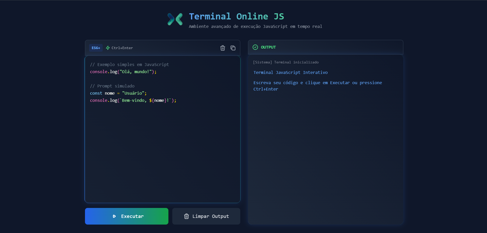

# 🚀 JS Terminal Pro - Online JavaScript Execution Environment

[](https://opensource.org/licenses/MIT)
[](https://developer.mozilla.org/docs/Web/JavaScript)

**Ambiente avançado para execução de JavaScript em tempo real com syntax highlighting e recursos profissionais**


 <!-- Adicione uma screenshot -->

## ✨ Recursos Principais

- **⚡ Execução em Tempo Real**  
  Execute código JS instantaneamente com `Ctrl+Enter`
  
- **🎨 Syntax Highlighting Inteligente**  
  Suporte completo para ES6+ com cores semânticas

- **📈 Layout Dinâmico**  
  Editor que expande automaticamente com seu código

- **🔒 Ambiente Seguro**  
  Execução em sandbox com tratamento de erros

- **📋 Histórico Persistente**  
  Salvamento automático no localStorage

- **🚦 Console Interativo**  
  Saída colorida para logs, erros e prompts

## 🛠️ Tech Stack & Ferramentas

<div align="left">
  
</div>

**Desenvolvimento Principal:**
-  HTML5
-  Tailwind CSS
-  JavaScript Moderno

**Ecossistema:**
-  Prism.js (Syntax Highlight)
-  Fira Code (Font)
-  GitHub Pages

**Dev Tools:**
-  VS Code
-  Git

## 🖥️ Como Usar

1. **Escreva seu código** no editor principal
```javascript
// Exemplo de código
const greeting = name => console.log(`Olá ${name}!`);
greeting('Mundo JS');
```

2. **Execute com:**
   - Botão `Executar`
   - Atalho `Ctrl + Enter`

3. **Resultados aparecem** no terminal à direita

**Recursos Especiais:**
- `Limpar Terminal`: Remove todo o histórico de output
- `Copiar Código`: Copia o código atual para área de transferência
- `Estatísticas`: Tempo de execução exibido automaticamente

## 🚀 Instalação Local

1. Clone o repositório:
```bash
git clone https://github.com/seu-usuario/js-terminal-pro.git
```

2. Acesse o diretório:
```bash
cd js-terminal-pro
```

3. Abra no navegador:
```bash
open index.html  # Ou clique duplo no arquivo
```

**Requisitos:**  
- Navegador moderno (Chrome 90+, Firefox 88+)
- Conexão internet (para CDNs)


## 📄 Licença

Distribuído sob licença MIT. Veja `LICENSE` para mais informações.

## ✉️ Contato

Instagram- [https://instagram.com/dev_inojoza_] 
Hub de Conexões: [https://inojoza28.github.io/conexoes]

---

**Feito com ❤️ por Gabriel Inojoza**  
[](https://github.com/inojoza28)


